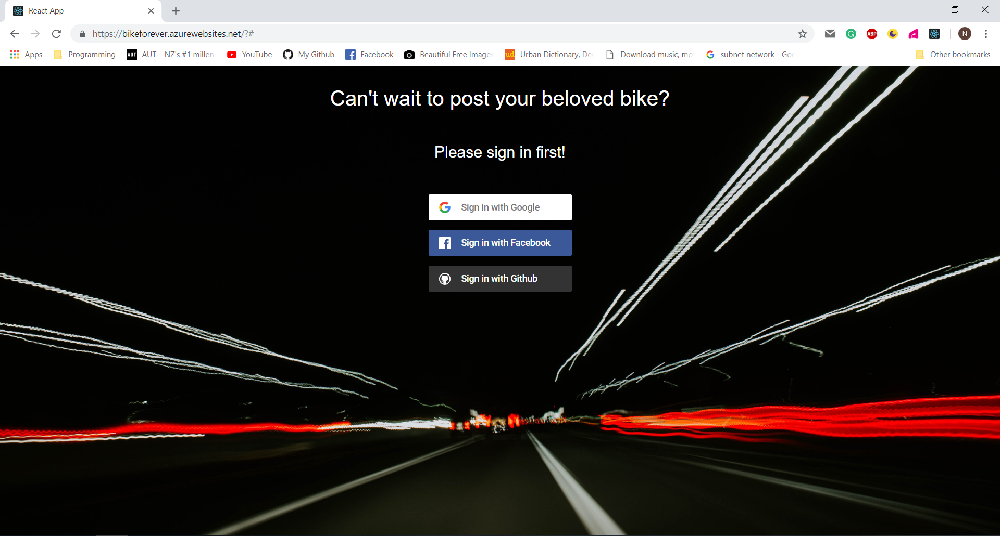
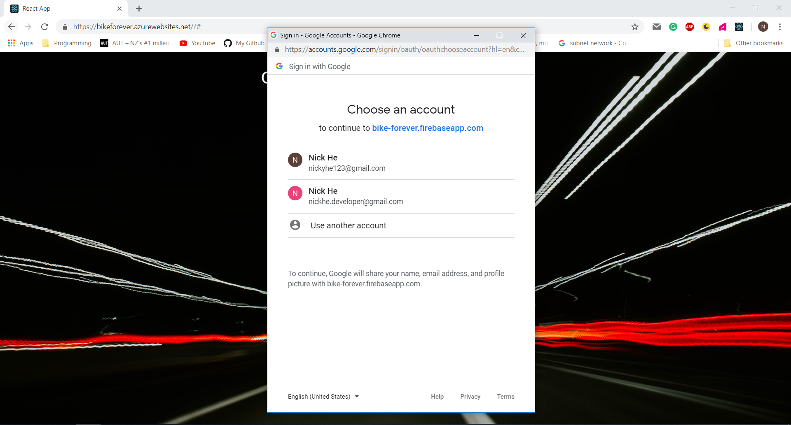
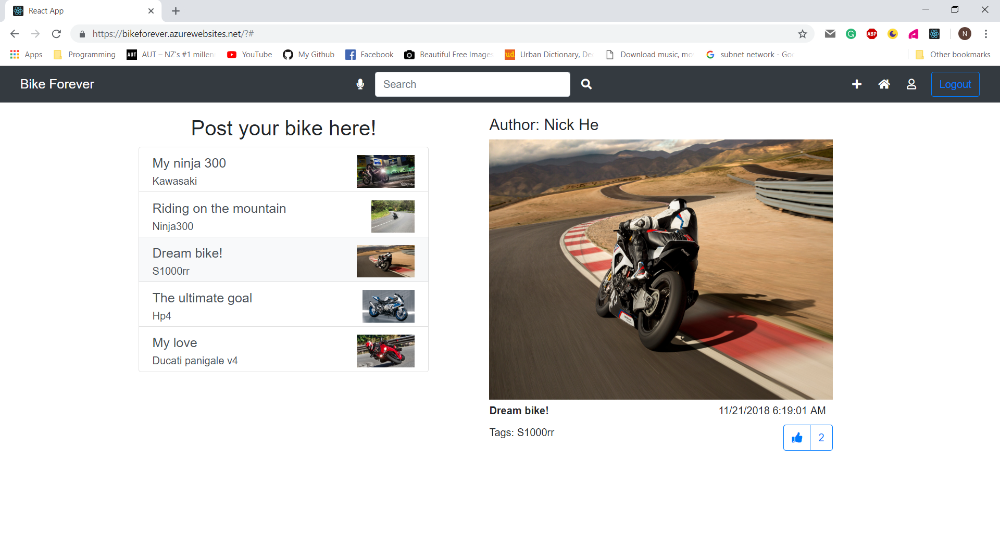
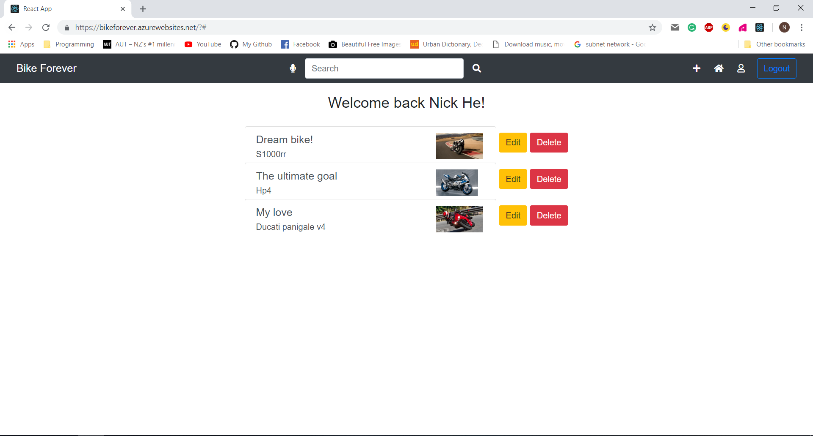
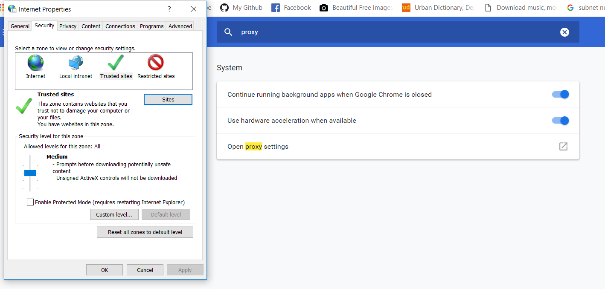
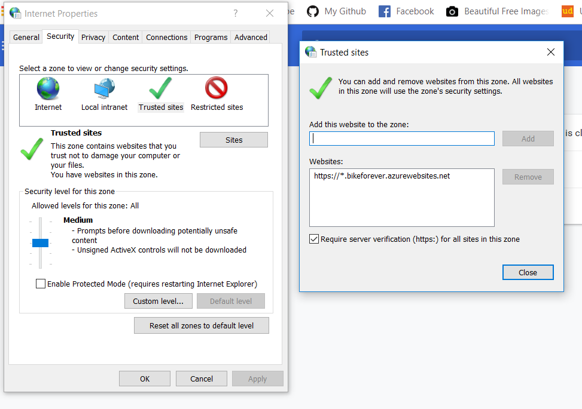
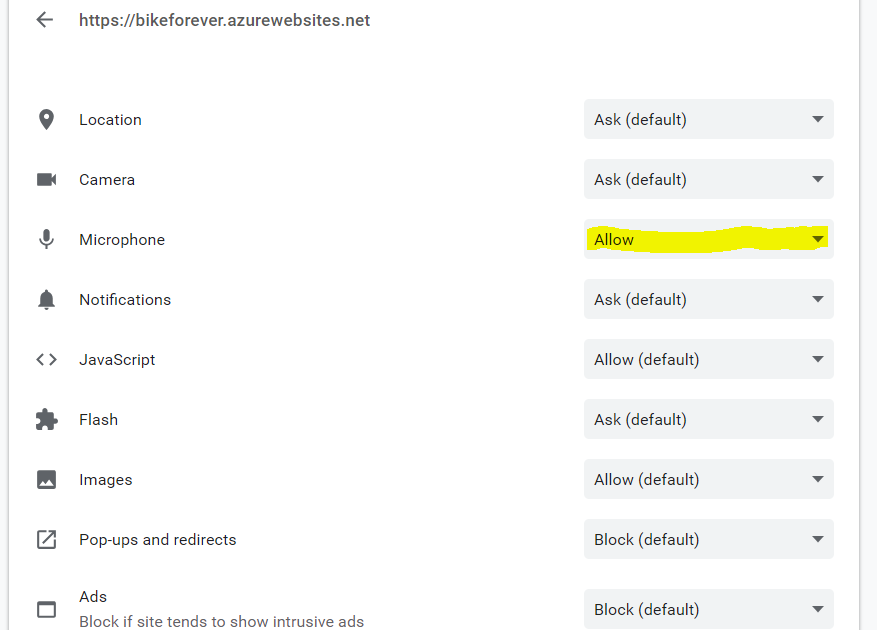

# BikeForever
It is a web application using React & Typescript. This app is built for motorcyclers to post their beloved bikes or anything related to bikes.

## Demo

- Frontend   https://bikeforever.azurewebsites.net/
- Backend    https://github.com/NickyhePro/BikeForeverAPI

## Instructions

Before you run the app, you need to add this website into your trusted sites list. Here is the example for Chrome.

Then you need to make sure you have granted the permission for the web to access the microphone.

## Features

- React & Typescript
- Firebase authentication integrated with Facebook, Github and Google
- Customized REST API that supports CRUD functions
- Supported voice searching function
- Customized UI with FontAwesome icons

## Tech Stack

- React
- Typescript
- ASP.NET Core
- C#
- Entity Framework core 
- Azure Cloud Service 

